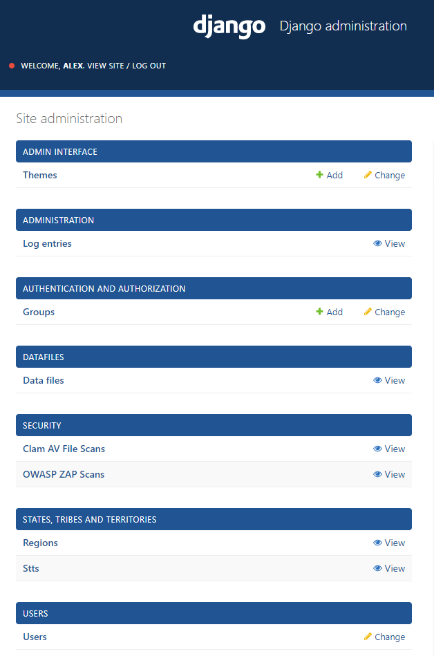
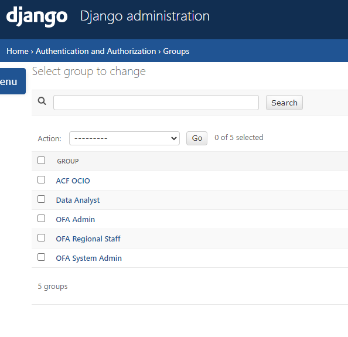
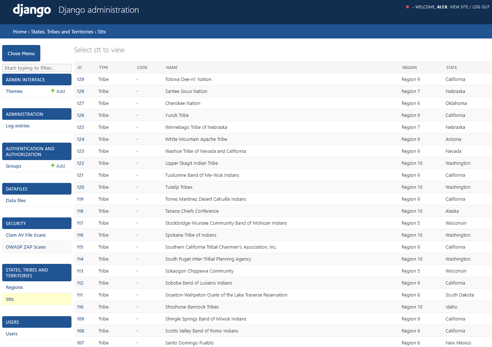
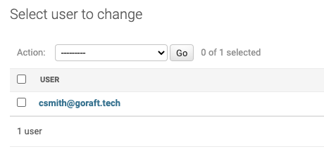

# User Role Management

## Updating User Roles through the Django Admin Interface

**Description**

For the OFA MVP we will be assigning and updating application user roles through the
Django Admin Interface. This can be accessed via the backend at:

`<backend-domain-name>/admin/`

The admin interface requires special privileges which can only be granted via the
Django CLI [Detailed Below](#cli) or a Django Data migration. 

Once a user has been granted privileges they can go to the admin page described above
and log in. The admin interface provides links to Users, STTs, Regions and Groups which
can can be each be modified through the interface.

### Log in to Admin

- Go to `<frontend-domain-name>`
- Sign in through `login.gov`
- Go to `<backend-domain-name>/admin/`

_Alternatively_

- Go to `<backend-domain-name>/admin/`
- You will be redirected to `login.gov`
- Use your `login.gov` credentials to login
- You will be redirected back to the main application
- Go to `<backend-domain-name>/admin/`

### Admin Home

- The admin home page gives you access to all of the objects you can manage



### Group List

- Clicking on "Groups" from the Admin Home page gives you a list of all of the existing groups.
- Current groups listed are "System Admin", "OFA Admin" , and "Data Prepper" (this will be updated when [#940](https://github.com/raft-tech/TANF-app/issues/940) is addressed).



### Group Permissions

- When you click on a group in the Group List, you can add/update/remove permissions for each group.


### Region List

- When you click on "Regions" from the Admin Home page, you can view the regions currently in the system


### STT List

- When you click on "STTs" from the Admin Home page, you can view a list of the STTs currently in the system



### STT Edit

- Clicking on an STT allows you to update it's data


### User List

- When you click on "Users" from the Admin Home page, you can see a list of users currently in the system.



### User Edit

- When you click on a user from the User List, you can edit that user's information, including
first name, last name and username, as well as the user's Active Status, Superuser Status, Staff Status, assigned Groups, STT and Region. You can
also view the user's login.gov UUID, as well as the date and time the user joined and when they last logged in. Note: now that TDP users are identified via their login.gov [UUID](https://github.com/raft-tech/TANF-app/pull/894), any backend changes to the user's first, last, and username will be overwritten by these fields from the user's login.gov account the next time the user logs into TDP. 


## <a id="cli"></a> Updating User Roles through the CLI

**Description**

For the OFA MVP, we will need to assign the Django built-in roles of `superuser` and `staff` to the deployed applicataion.
This will be needed for users to have access to the Django Admin interface detailed above.

This guide will provide instructions on how to define them in local and deployed environments. 
Access to the CLI is strictly controlled by the Product Owner. 


**Local Development**
	
1.) After following the instructions in the README.md for the TDRS Frontend and 
Backend services, you will now be able to login via Login.gov which will result in 
your account being generated and stored in the local database.

2.) With the backend instance running execute the following commands from the 
`tdrs-backend` directory:

  
   ```bash
   docker-compose run web sh -c "python manage.py shell"
   ```
   This will open up a shell prompt that will allow you to execute commands 
   directly to the TDRS Backend Django application.
   
   To update your user, edit the sample script below to reflect your Login.gov 
   email associated with your login process and press enter.  After this you may 
   exit the shell and resume using the application with the `superuser` role. 
   
   ```
from django.contrib.auth import get_user_model
User = get_user_model()
user = User.objects.get(username="test@example.com")
user.is_superuser = True
user.save()
```

To assign the user to a custom role, like `Data Prepper` use the following

```
from django.contrib.auth.models import Group
from django.contrib.auth import get_user_model

data_prepper = Group.objects.get(name="Data Prepper")
User = get_user_model()
user = User.objects.get(username="test@example.com")
data_prepper.user_set.add(user)

```
 
 
 **Deployed Evironment**
	
1.) Users targeted for Superuser creation will have to be manually elevated by system administrators with access to the intended Cloud.gov environment. 

2.) Admins with access will have to ssh into the environment via the following command 

 ```bash
   cf ssh tdp-backend
```

3.) After moving into the `tdpapp` directory, the admin will then have to set the alias for the python executable if it has not been set and execute the shell script to promote the existing user.

Commands to move to the correct directory and make python available  
```bash 
cd ../tdpapp 
alias pytemp='/usr/local/bin/python3.7' 
pytemp manage.py shell 
```

Python script to promote the targer user to `superuser`: 

```
from django.contrib.auth import get_user_model
User = get_user_model()
user = User.objects.get(username="test@example.com")
user.is_superuser = True
user.save()
```
See an example of this [here](../images/make_superuser_example.png)

To assign the user to a custom role, like `Data Prepper` use the following

```
from django.contrib.auth.models import Group
from django.contrib.auth import get_user_model

data_prepper = Group.objects.get(name="Data Prepper")
User = get_user_model()
user = User.objects.get(username="test@example.com")
data_prepper.user_set.add(user)
